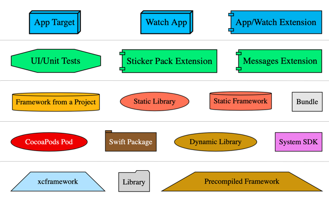

### Graph

When projects grow, it becomes hard to visualize the dependencies between all the targets that are part of the project.
Fortunately, Tuist provides a command, `tuist graph`, that loads your project dependencies graph and exports it. As the
saying goes, "one image is worth a thousand words":


The command will output the dependency graph as an image, in the `png` format.
You can also change the format to `dot` (see [DOT](<https://en.wikipedia.org/wiki/DOT_(graph_description_language)>))
to get the raw contents of the graph.
:::caution
You can also change the format to `json` to export the graph as a JSON file. The JSON schema is subject
to change and may be breaking across major versions.
:::

### Command

Run the following command from a directory that contains a workspace or project manifest:

```bash
tuist graph
```

If you prefer to have the dot or json representations of the graph and render it separately, you can run:

```bash
tuist graph --format [dot|json]
```

To show the graph of only specific targets and their dependencies, you can run:

```
tuist graph FrameworkA FrameworkB
```

#### Legend

The graph command will style every type of target or dependency differently. This makes it easier to understand
and visualize the graph. App targets, swift packages, frameworks, and all other types will have different shapes and colors.
To better understand what which one means, you can use the following legend as a reference.



If you prefer the old style, without different colors and shapes, pass the `--simple` flag when creating the graph.

#### Arguments

| Argument                       | Short | Description                                                                                                      | Values                                                                                                                             | Default           | Required |
| ------------------------------ | ----- | ---------------------------------------------------------------------------------------------------------------- | ---------------------------------------------------------------------------------------------------------------------------------- | ----------------- | -------- |
| `--skip-test-targets`          | `-t`  | Excludes test targets from the generated graph.                                                                  |                                                                                                                                    |                   | No       |
| `--skip-external-dependencies` | `-d`  | Excludes external dependencies from the generated graph.                                                         |                                                                                                                                    |                   | No       |
| `--format`                     | `-f`  | The format of the generated graph.                                                                               | `dot`, `png`, `json`                                                                                                                       | `png`             | No       |
| `--simple`                     | `-s`  | Simple graph: disable different shapes and colors.                                                               |                                                                                                                                    |                   | No       |
| `--algorithm`                  | `-a`  | The algorithm used for drawing the graph. For large graphs, it's recommended to use `fdp`.                       | `dot`, `neato`, `twopi`, `circo`, `fdp`, `sfdp`, `patchwork`                                                                       | `dot`             | No       |
| `--path`                       | `-p`  | The path to the directory that contains the definition of the project.                                           |                                                                                                                                    | Current directory | No       |
| `--output-path`                | `-o`  | The path to where the image will be exported. When not specified, it exports the image in the current directory. |                                                                                                                                    |                   | No       |
| `--targets`                    | `-t`  | The path to where the image will be exported. When not specified, it exports the image in the current directory. | A list of targets to filter. Those and their dependent targets will be showed in the graph. If empty, every target will be showed. |                   | No       |

#### JSON output schema

When the `--format` argument is specified as `json`, the following JSON schema is output into the `graph.json` file.

| Key        | Description                                           |
| ---------- | ----------------------------------------------------- |
| `name`     | Name of the manifest.                                 |
| `path`     | Absolute path to the manifest.                        |
| `projects` | A map of project absolute paths to `Project` objects. |

##### Project

| Key        | Description                   |
| ---------- | ----------------------------- |
| `name`     | Name of the project.          |
| `path`     | Absolute path to the project. |
| `targets`  | A list of `Target` objects.   |
| `schemes`  | A list of `Scheme` objects.   |
| `packages` | A list of `Package` objects.  |

##### Target

| Key       | Description                                                                                                             |
| --------- | ----------------------------------------------------------------------------------------------------------------------- |
| `name`    | Name of the target.                                                                                                     |
| `product` | The product type of the target. See (Product)[https://docs.tuist.io/manifests/project#product] for all possible values. |

##### Scheme

| Key                 | Description                                                     |
| ------------------- | --------------------------------------------------------------- |
| `name`              | Name of the scheme.                                             |
| `testActionTargets` | A list of targets names that are tested as part of this scheme. |

##### Package

| Key    | Description                                                                                                      |
| ------ | ---------------------------------------------------------------------------------------------------------------- |
| `kind` | The type of the package. See (Package)[https://docs.tuist.io/manifests/project#package] for all possible values. |
| `path` | Absolute path to the package.                                                                                    |

Sample JSON output:
```
{
    "name": "NAME_OF_MANIFEST",
    "path": "PATH_TO_MANIFEST_DIR",
    "projects": {
        "PATH_TO_PROJECT": {
            "name": "NAME_OF_PROJECT",
            "path": "PATH_TO_PROJECT",
            "targets": [
                {
                    "name": "NAME_OF_TARGET",
                    "product": "TYPE_OF_PRODUCT"
                }
            ],
            "schemes": [
                {
                    "name": "NAME_OF_SCHEME",
                    "testActionTargets": [
                        "TEST_ACTION_TARGET"
                    ]
                }
            ],
            "packages": [
                {
                    "kind": "KIND_OF_PACKAGE_REMOTE_OR_LOCAL",
                    "path": "PATH_OR_URL_OF_PACKAGE"
                }
            ]
        }
    }
}
```
